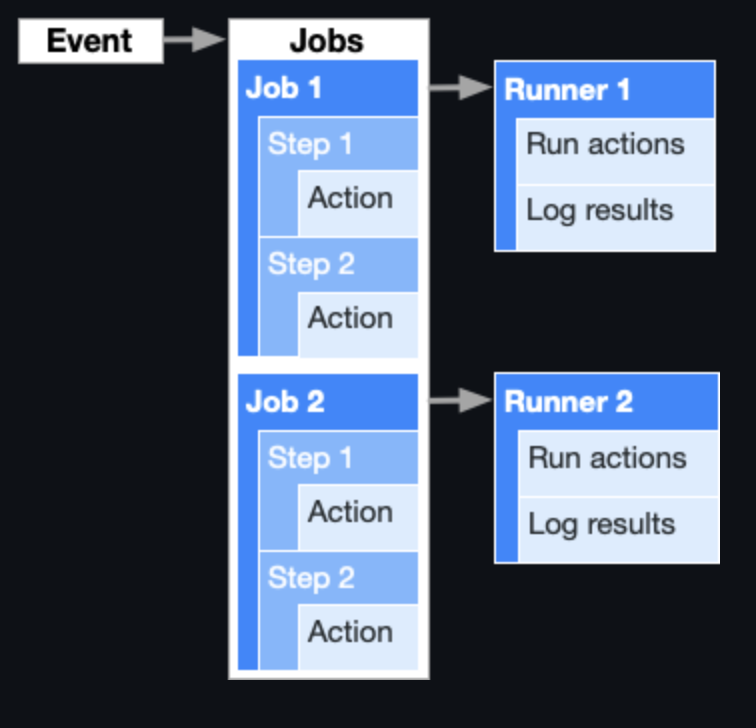

# github-actions-practice
Github Actions Practice

## index  

  - [What is this?](#what-is-this)
  - [.github/workflows/*.yml](#githubworkflowsyml)
  - [Components](#components)

 

## What is this?         
github actions 는 특정 이벤트나 web hook을 통해 특정한 task를 자동으로 실행할 수 있도록 도와주는 기능이다.       

 

## .github/workflows/*.yml         
github actions을 정의하기 위해선 github repository내에 .github/workflows/*.yml 포맷으로 서술하면 자동으로 인식된다.           

 

## Components        

* workflow : job으로 구성되며, 정의된 event 유형에 따라 실행된다.       
* event : workflow 가 실행되는 조건이다.  
  * [event 종류 & syntax](https://docs.github.com/en/actions/reference/workflow-syntax-for-github-actions#on)
* job : step의 묶음이다.
  * 기본적으로 여러개의 job은 각각 runner에 할당되어 parallel로 수행된다.
  * 만약 job 간 sequential하게 수행되어야 하는 경우 설정할 수 있다.      
* step : 커맨드의 단위라고 볼수 있다.
  * shell 커맨드로 작성할 수 있다.
  * 미리 정의한 action으로 작성할 수 있다.
* action : 독립적인 실행 단위이며 step에 포함된다.
  * custom action을 정의하여 사용할 수 있다.
  * [커뮤니티에 정의된 action](https://github.com/marketplace?type=actions)을 사용할 수 있다.
* runner : [Github Actions Runner Application](https://github.com/actions/runner)가 설치된 server 다. 
  * github에서 제공해준다.
  * 별도의 서버에 GAR App을 설치하여 사용할 수 있다.

